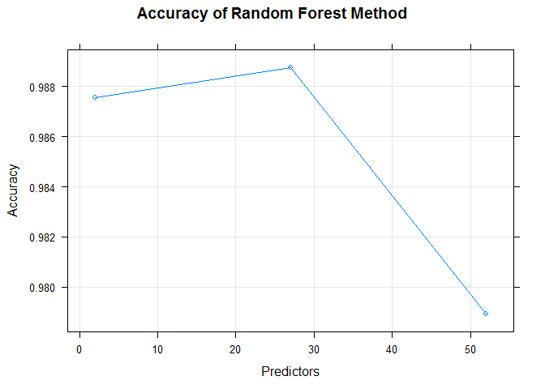

-   [Executive Summary](#executive-summary)
-   [Background](#background)
-   [Data](#data)
-   [Data Loading](#data-loading)
-   [Data Cleaning](#data-cleaning)
-   [Cross Validation](#cross-validation)
-   [Model Training](#model-training)
    -   [1: Random Forest](#random-forest)
    -   [2: LDA](#lda)
    -   [3: Generalized Boosted Model](#generalized-boosted-model)
-   [Prediction](#prediction)
    -   [1: Random Forest](#random-forest-1)
    -   [2: LDA](#lda-1)
    -   [3: Generalized Boosted Model](#generalized-boosted-model-1)
    -   [Prediction Summary](#prediction-summary)
-   [Out-of-Sample Error](#out-of-sample-error)
-   [Submission: Application of selected model to provided testing dataset](#submission-application-of-selected-model-to-provided-testing-dataset)
-   [References](#references)

Executive Summary
-----------------

In this report, I present a prediction model to quantify how well an activity was performed. I use data from accelerometers on the belt, forearm, arm, and dumbell of 6 participants who were asked to perform barbell lifts correctly and incorrectly in 5 different ways.

Background
----------

Using devices such as Jawbone Up, Nike FuelBand, and Fitbit it is now possible to collect a large amount of data about personal activity relatively inexpensively. These type of devices are part of the quantified self movement - a group of enthusiasts who take measurements about themselves regularly to improve their health, to find patterns in their behavior, or because they are tech geeks. One thing that people regularly do is quantify how much of a particular activity they do, but they rarely quantify how well they do it.

Participants were asked to perform one set of 10 repetition of the Unilateral Dumbbell Biceps Curl in five different fashions \[1\]:

-   exactly according to the specifcation (Class A)
-   throwing the elbows to the front (Class B)
-   lifting the dumbbell only halfway (Class C)
-   lowering the dumbbell only halfway (Class D)
-   throwing the hips to the front (Class E)

Class A corresponds to the specifed execution of the exercise, while the other 4 classes correspond to common mistakes.

Data
----

The training data for building this model was obtained from:

<https://d396qusza40orc.cloudfront.net/predmachlearn/pml-training.csv>

The test dataset set was obtained from:

<https://d396qusza40orc.cloudfront.net/predmachlearn/pml-testing.csv>

These datasets were made available by <http://groupware.les.inf.puc-rio.br/har>.

Data Loading
------------

``` r
fileUrl <- "https://d396qusza40orc.cloudfront.net/predmachlearn/pml-training.csv"
fname <- "pml-training.csv"

if (file.exists(fname)) {
    pml_training <- read.csv(fname, na.strings=c("NA",""))
} else { 
    download.file(fileUrl, destfile = fname)
    pml_training <- read.csv(fname, na.strings=c("NA",""))
}  

fileUrl <- "https://d396qusza40orc.cloudfront.net/predmachlearn/pml-testing.csv"
fname <- "pml-testing.csv"

if (file.exists(fname)) {
    pml_testing <- read.csv(fname, na.strings=c("NA",""))
} else { 
    download.file(fileUrl, destfile = fname)
    pml_testing <- read.csv(fname, na.strings=c("NA",""))
} 
```

Data Cleaning
-------------

``` r
sumNA <- function(x) sum(is.na(x))
numRows <- nrow(pml_training)

# Remove columns with data that cannot be used in prediction. i.e. names, timestamps etc
exclude_hdrs <- grep("name|timestamp|window|X", colnames(pml_training), value=FALSE) 
training <- pml_training[,-exclude_hdrs]

# Use variables with low NA ratio -- threshold is 90%
ratioNA  <- apply(training, 2, sumNA)/numRows
training <- training[,ratioNA < 0.1]

training$classe = factor(training$classe)

# examine the resulting data frame
dim(training)
```

    ## [1] 19622    53

``` r
# apply same to testing
exclude_hdrs_testing <- grep("name|timestamp|window|X", colnames(pml_testing), value=FALSE) 
testing <- pml_testing[,-exclude_hdrs_testing]
testing <- testing[,ratioNA < 0.1]
```

Cross Validation
----------------

We eprform cross-validation by subsampling our training data into two subsets: a training subset, and a test subset. The training subset consist of 70% of the original training data while the test subset consists of the remaining 30% of the original training set.

``` r
set.seed(7311)

train <- createDataPartition (y=training$classe, p = .70, list = FALSE)
sub_training <- training[train,]
sub_testing  <- training[-train,]
```

Model Training
--------------

A series of prediction models explained below are computed with the goal of choosing the best performer.

### 1: Random Forest

For this model, I use the "rf" method of the train function in the caret package.

``` r
fit.rf <- suppressMessages(train(classe ~ ., method="rf", data=sub_training))
```

``` r
print(fit.rf)
```

    ## Random Forest 
    ## 
    ## 13737 samples
    ##    52 predictor
    ##     5 classes: 'A', 'B', 'C', 'D', 'E' 
    ## 
    ## No pre-processing
    ## Resampling: Bootstrapped (25 reps) 
    ## Summary of sample sizes: 13737, 13737, 13737, 13737, 13737, 13737, ... 
    ## Resampling results across tuning parameters:
    ## 
    ##   mtry  Accuracy   Kappa    
    ##    2    0.9875585  0.9842558
    ##   27    0.9887708  0.9857911
    ##   52    0.9789070  0.9733100
    ## 
    ## Accuracy was used to select the optimal model using  the largest value.
    ## The final value used for the model was mtry = 27.

### 2: LDA

For this model, I use the "lda" method of the train function in the caret package.

``` r
fit.lda <- suppressMessages(train(classe ~ ., method="lda", data=sub_training))
print(fit.lda)
```

    ## Linear Discriminant Analysis 
    ## 
    ## 13737 samples
    ##    52 predictor
    ##     5 classes: 'A', 'B', 'C', 'D', 'E' 
    ## 
    ## No pre-processing
    ## Resampling: Bootstrapped (25 reps) 
    ## Summary of sample sizes: 13737, 13737, 13737, 13737, 13737, 13737, ... 
    ## Resampling results:
    ## 
    ##   Accuracy   Kappa   
    ##   0.7016581  0.622577
    ## 
    ## 

### 3: Generalized Boosted Model

For this model, I use the "gbm" method of the train function in the caret package.

``` r
fit.gbm <- suppressMessages(train(classe ~ ., method="gbm", data=sub_training))
```

``` r
print(fit.gbm)
```

    ## Stochastic Gradient Boosting 
    ## 
    ## 13737 samples
    ##    52 predictor
    ##     5 classes: 'A', 'B', 'C', 'D', 'E' 
    ## 
    ## No pre-processing
    ## Resampling: Bootstrapped (25 reps) 
    ## Summary of sample sizes: 13737, 13737, 13737, 13737, 13737, 13737, ... 
    ## Resampling results across tuning parameters:
    ## 
    ##   interaction.depth  n.trees  Accuracy   Kappa    
    ##   1                   50      0.7508704  0.6839785
    ##   1                  100      0.8179894  0.7696772
    ##   1                  150      0.8505881  0.8109439
    ##   2                   50      0.8532265  0.8140752
    ##   2                  100      0.9045675  0.8792348
    ##   2                  150      0.9287699  0.9098624
    ##   3                   50      0.8954808  0.8676861
    ##   3                  100      0.9389803  0.9227839
    ##   3                  150      0.9575857  0.9463378
    ## 
    ## Tuning parameter 'shrinkage' was held constant at a value of 0.1
    ## 
    ## Tuning parameter 'n.minobsinnode' was held constant at a value of 10
    ## Accuracy was used to select the optimal model using  the largest value.
    ## The final values used for the model were n.trees = 150,
    ##  interaction.depth = 3, shrinkage = 0.1 and n.minobsinnode = 10.

Prediction
----------

Resulting predictions are as follows:

### 1: Random Forest

``` r
pred.rf  <- predict(fit.rf, newdata=sub_testing)
confusionMatrix(pred.rf, sub_testing$classe)
```

    ## Confusion Matrix and Statistics
    ## 
    ##           Reference
    ## Prediction    A    B    C    D    E
    ##          A 1669    6    0    0    0
    ##          B    5 1130    4    2    0
    ##          C    0    3 1018   13    0
    ##          D    0    0    4  947    3
    ##          E    0    0    0    2 1079
    ## 
    ## Overall Statistics
    ##                                           
    ##                Accuracy : 0.9929          
    ##                  95% CI : (0.9904, 0.9949)
    ##     No Information Rate : 0.2845          
    ##     P-Value [Acc > NIR] : < 2.2e-16       
    ##                                           
    ##                   Kappa : 0.991           
    ##  Mcnemar's Test P-Value : NA              
    ## 
    ## Statistics by Class:
    ## 
    ##                      Class: A Class: B Class: C Class: D Class: E
    ## Sensitivity            0.9970   0.9921   0.9922   0.9824   0.9972
    ## Specificity            0.9986   0.9977   0.9967   0.9986   0.9996
    ## Pos Pred Value         0.9964   0.9904   0.9845   0.9927   0.9981
    ## Neg Pred Value         0.9988   0.9981   0.9984   0.9966   0.9994
    ## Prevalence             0.2845   0.1935   0.1743   0.1638   0.1839
    ## Detection Rate         0.2836   0.1920   0.1730   0.1609   0.1833
    ## Detection Prevalence   0.2846   0.1939   0.1757   0.1621   0.1837
    ## Balanced Accuracy      0.9978   0.9949   0.9945   0.9905   0.9984

### 2: LDA

``` r
pred.lda  <- predict(fit.lda, newdata=sub_testing)
confusionMatrix(pred.lda, sub_testing$classe)
```

    ## Confusion Matrix and Statistics
    ## 
    ##           Reference
    ## Prediction    A    B    C    D    E
    ##          A 1372  170  100   49   45
    ##          B   34  719  114   38  196
    ##          C  116  147  650  124  103
    ##          D  148   47  137  716   99
    ##          E    4   56   25   37  639
    ## 
    ## Overall Statistics
    ##                                           
    ##                Accuracy : 0.696           
    ##                  95% CI : (0.6841, 0.7077)
    ##     No Information Rate : 0.2845          
    ##     P-Value [Acc > NIR] : < 2.2e-16       
    ##                                           
    ##                   Kappa : 0.6154          
    ##  Mcnemar's Test P-Value : < 2.2e-16       
    ## 
    ## Statistics by Class:
    ## 
    ##                      Class: A Class: B Class: C Class: D Class: E
    ## Sensitivity            0.8196   0.6313   0.6335   0.7427   0.5906
    ## Specificity            0.9136   0.9195   0.8992   0.9124   0.9746
    ## Pos Pred Value         0.7903   0.6530   0.5702   0.6242   0.8397
    ## Neg Pred Value         0.9272   0.9122   0.9208   0.9477   0.9135
    ## Prevalence             0.2845   0.1935   0.1743   0.1638   0.1839
    ## Detection Rate         0.2331   0.1222   0.1105   0.1217   0.1086
    ## Detection Prevalence   0.2950   0.1871   0.1937   0.1949   0.1293
    ## Balanced Accuracy      0.8666   0.7754   0.7663   0.8276   0.7826

### 3: Generalized Boosted Model

``` r
pred.gbm  <- predict(fit.gbm, newdata=sub_testing)
confusionMatrix(pred.gbm, sub_testing$classe)
```

    ## Confusion Matrix and Statistics
    ## 
    ##           Reference
    ## Prediction    A    B    C    D    E
    ##          A 1645   30    0    1    2
    ##          B   16 1084   32    8    8
    ##          C    6   24  979   37    8
    ##          D    6    1   15  911   13
    ##          E    1    0    0    7 1051
    ## 
    ## Overall Statistics
    ##                                           
    ##                Accuracy : 0.9635          
    ##                  95% CI : (0.9584, 0.9681)
    ##     No Information Rate : 0.2845          
    ##     P-Value [Acc > NIR] : < 2.2e-16       
    ##                                           
    ##                   Kappa : 0.9538          
    ##  Mcnemar's Test P-Value : 6.581e-07       
    ## 
    ## Statistics by Class:
    ## 
    ##                      Class: A Class: B Class: C Class: D Class: E
    ## Sensitivity            0.9827   0.9517   0.9542   0.9450   0.9713
    ## Specificity            0.9922   0.9865   0.9846   0.9929   0.9983
    ## Pos Pred Value         0.9803   0.9443   0.9288   0.9630   0.9924
    ## Neg Pred Value         0.9931   0.9884   0.9903   0.9893   0.9936
    ## Prevalence             0.2845   0.1935   0.1743   0.1638   0.1839
    ## Detection Rate         0.2795   0.1842   0.1664   0.1548   0.1786
    ## Detection Prevalence   0.2851   0.1951   0.1791   0.1607   0.1799
    ## Balanced Accuracy      0.9874   0.9691   0.9694   0.9690   0.9848

### Prediction Summary

The best results of these prediction models were produced by the random forest method as shown in the confusion matrix output with an accuracy of 99.29%.

``` r
# random forest model plot
plot(fit.rf, log = "y", main = "Accuracy of Random Forest Method", xlab = "Predictors", ylab = "Accuracy")
```

<!-- -->

Out-of-Sample Error
-------------------

We expect out of sample error to arise primarily from inaccuracies in class labeling. i.e. if an activity is not properly labeled, errors will be introduced.

``` r
true_accuracy <- sum(pred.rf == sub_testing$classe)/length(pred.rf)
oos_error  <- 1 - true_accuracy
```

The out-of-sample error is 0.71%.

Submission: Application of selected model to provided testing dataset
---------------------------------------------------------------------

``` r
pred.rf.testing  <- predict(fit.rf, newdata=testing)
pred.rf.testing
```

    ##  [1] B A B A A E D B A A B C B A E E A B B B
    ## Levels: A B C D E

``` r
summary(pred.rf.testing)
```

    ## A B C D E 
    ## 7 8 1 1 3

References
----------

\[1\] Velloso, E.; Bulling, A.; Gellersen, H.; Ugulino, W.; Fuks, H. Qualitative Activity Recognition of Weight Lifting Exercises. Proceedings of 4th International Conference in Cooperation with SIGCHI (Augmented Human '13) . Stuttgart, Germany: ACM SIGCHI, 2013.
